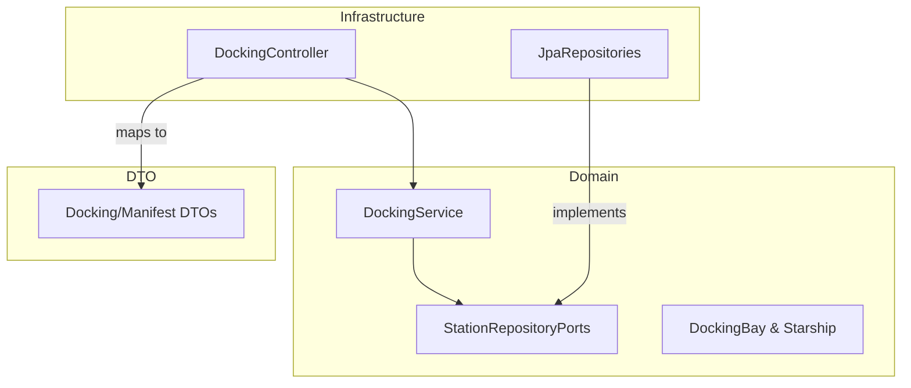

# Stardust Station Control System

This project is a mission-critical **Docking & Resource Allocation Engine** for a deep-space station. It demonstrates how to build a reliable, thread-safe reservation system using a clean, test-first approach.

## The Mission

Stardust Station serves as a neutral hub for various interstellar fleets. The primary goal of this system is to manage the complex logistics of docking starships while enforcing strict safety and protocol rules:

1.  **Fleet Protocol Enforcement**: Restricting docking bays to specific fleet affiliations (Science, Trading, Military) to ensure resource compatibility.
2.  **Docking Integrity**: Ensuring that state transitions (assigning a bay) are guarded by strict occupancy checks to prevent catastrophic collisions.
3.  **Concurrency Mitigation**: Leveraging Optimistic Locking via JPA `@Version` to handle high-concurrency scenarios where multiple starships might attempt to reserve the same docking bay simultaneously.

## Engineering Stack

- **Language**: Kotlin 1.9.25 (Expressive, null-safe, and concise)
- **Framework**: Spring Boot 3.4.1 
- **Data Layer**: Spring Data JPA with H2 (In-memory feedback loops)
- **Observability**: Spring Actuator & Micrometer (Prometheus metrics)
- **Testing**: JUnit 5, MockK, and ArchUnit (Behavior & Architecture verification)
- **Quality**: ktlint for automated style enforcement

## System Architecture & Patterns

The implementation follows **Hexagonal Architecture (Ports & Adapters)** principles to ensure high maintainability and decoupling of business logic from infrastructure.

### Architectural Overview



- **Domain Layer**: The heart of the application containing pure business logic (`DockingService`) and entity models. It remains agnostic of the database or web framework.
- **Port Layer**: Interface definitions for out-bound communication (e.g., `DockingBayRepository`).
- **Infrastructure Layer**: Technical implementations of the ports (JPA/Hibernate) and entry points for the application (REST Controllers).
- **DTO Pattern**: We use Data Transfer Objects to ensure that internal persistence models never leak to the API.

## Getting Started

### Prerequisites
Construction and execution require **JDK 21**.

### Setup
```bash
# Clone the repository
git clone <repository-url>
cd stardust-station

# Execute the full test suite
./gradlew test

# Launch the station control locally
./gradlew bootRun
```

## Logic Snapshot: `requestDocking`

The core logic handles the following protocol check-list before authorizing docking:
- **Existence**: Do the docking bay and starship registry exist?
- **Occupancy**: Is the docking bay currently free?
- **Protocol**: Does the starship's fleet affiliation match the bay's required protocol?
- **Concurrency**: Did another sensor update this bay while we were processing? (Managed by JPA Versioning)
