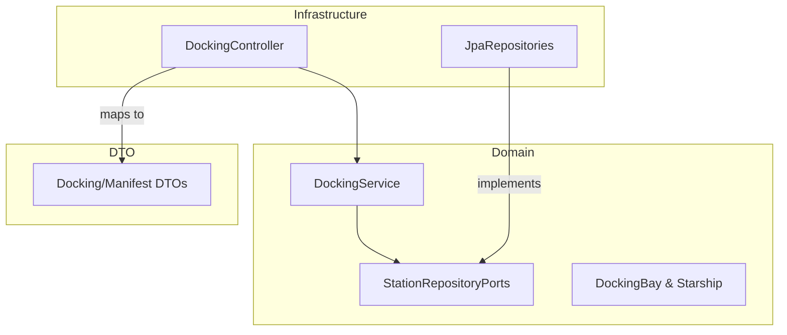

# Stardust Station Control System

This project is a mission-critical **Docking & Resource Allocation Engine** for a deep-space station. It demonstrates how to build a reliable, thread-safe reservation system using a clean, test-first approach.

## The Mission

Stardust Station serves as a neutral hub for various interstellar fleets. The primary goal of this system is to manage the complex logistics of docking starships while enforcing strict safety and protocol rules:

1.  **Fleet Protocol Enforcement**: Restricting docking bays to specific fleet affiliations (Science, Trading, Military) to ensure resource compatibility.
2.  **Docking Integrity**: Ensuring that state transitions (assigning a bay) are guarded by strict occupancy checks to prevent catastrophic collisions.
3.  **Concurrency Mitigation**: Leveraging Optimistic Locking via JPA `@Version` to handle high-concurrency scenarios where multiple starships might attempt to reserve the same docking bay simultaneously.

## Engineering Stack

- **Language**: Kotlin 2.1.20 (Expressive, null-safe, and AI-native)
- **Framework**: Spring Boot 3.4.3 
- **AI/MCP**: Spring AI MCP (Model Context Protocol) ready
- **Data Layer**: Spring Data JPA with H2 (In-memory persistence)
- **Observability**: Spring Actuator & Micrometer (Prometheus metrics)
- **Testing**: JUnit 5, MockK, and ArchUnit
- **Quality**: ktlint 14.0.1 for automated style enforcement

## Quick Start

### Prerequisites
- Java 21+

### Local Development
```bash
# Clone the repository
git clone <repository-url>
cd stardust-station

# Launch the station control locally
./gradlew bootRun
```

The service will be available at `http://localhost:8080`.

## Development Standards

Before pushing any code, ensure it meets the station's quality and style requirements:

1. **Format Code**: Run the auto-formatter to maintain consistency.
   ```bash
   ./gradlew ktlintFormat
   ```
2. **Verify Quality**: Run the lint check and all unit tests.
   ```bash
   ./gradlew check
   ```

## Documentation
- [Architecture Decision Records (ADRs)](docs/adr/)

## System Architecture & Patterns

The implementation follows **Hexagonal Architecture (Ports & Adapters)** principles to ensure high maintainability and decoupling of business logic from infrastructure.

### Architectural Overview



### Why Hexagonal Architecture?
Hexagonal (also known as Ports and Adapters) is the ideal architectural pattern for Stardust Station because:

1. **Inversion of Control**: The core Domain logic (the "Inside") defines its dependencies via Interfaces (Ports). Technical implementation details (the "Outside") like H2 or REST are kept separate.
2. **Testability**: Business logic can be tested in complete isolation without starting a heavy Spring Context or Database.

---
*Stardust Station: Integrity through Architecture.*
